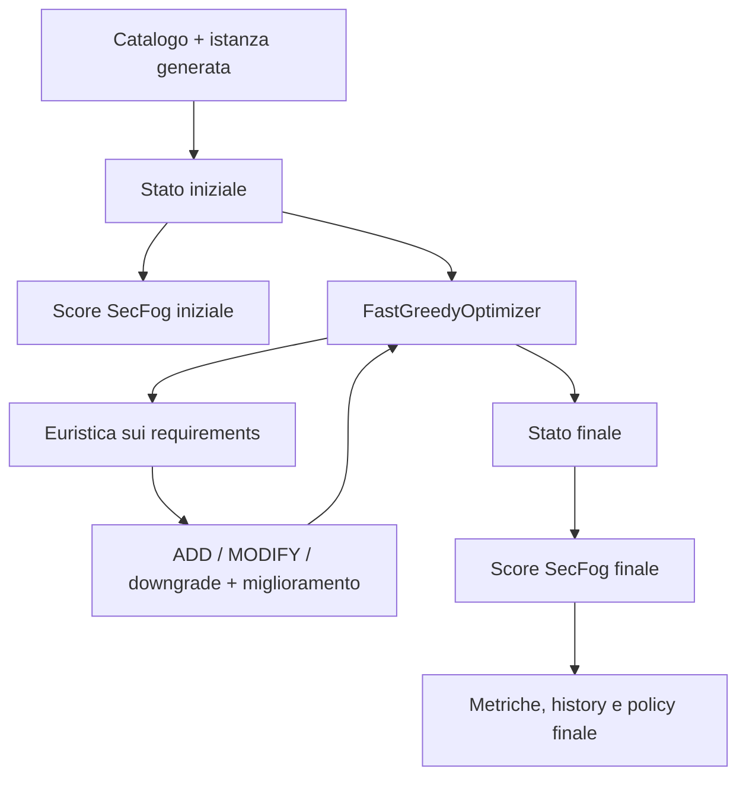

# Ottimizzazione di contromisure di sicurezza in ambienti Cloud–Edge

Progetto di tesi per l'ottimizzazione delle security capability su un placement Cloud–Edge fissato. Dato un budget, il sistema può aggiungere capability disponibili, modificarne il livello e usare downgrade senza disattivare capability inizialmente attive. Il placement dei servizi resta invariato.

La versione corrente usa `FastGreedyOptimizer`: le scelte intermedie sono guidate da un'euristica costruita sui security requirements, mentre SecFog/ProbLog viene usato come oracolo per valutare lo stato iniziale e quello finale.

## Installazione

Installa venv, problog e pytest (per i test).
```bash
python3 -m venv venv
source venv/bin/activate
python3 -m pip install --upgrade pip
python3 -m pip install -r requirements.txt #problog e pytest
```

## Esecuzione

Digitando su linea di comando:
```bash
python3 -m src.run_fast_greedy
```
parte l'esecuzione sul dataset predefinito (`instance_n25_s5_seed42`, budget 300).

E' possibile aggiungere opzioni come:
```bash
python3 -m src.run_fast_greedy --budget 300 --reversal-policy allow
```

È possibile specificare anche `--catalog`, `--infrastructure`, `--application`, `--placement` e `--base` per personalizzare l'esecuzione.

## Benchmark di scalabilità

Profilo rapido:
```bash
python3 -m experiments.run_fast_benchmarks --profile quick
```

Profilo tesi:

```bash
python3 -m experiments.run_fast_benchmarks --profile thesis
```

Esempio di esecuzione personalizzata:

```bash
python3 -m experiments.run_fast_benchmarks \
  --instances instance_n25_s5_seed42 instance_n50_s10_seed42 \
  --budgets 0 300 \
  --reversal-policies allow
```

I risultati vengono salvati in `results/` in formato CSV e JSON, salvo uso dell'opzione `--no-save`. I grafici sono generati da `experiments/plot_graphs.py` e salvati in `results/plots`


## Architettura

```text
.
├── experiments/    # benchmark e grafici
├── model/          # catalogo, profili e istanze scalabili generate
├── optimizer/      # stato, azioni, costi, requisiti, euristica e utility
├── prolog/         # regole SecFog usate come oracolo
├── results/        # output sperimentali
├── scoring/        # wrapper Python -> ProbLog
├── src/            # FastGreedyOptimizer e runner
```

Di seguito un resoconto delle componenti principali:
| Componente | Ruolo |
| --- | --- |
| `model/security_catalog.json` | Capability, livelli, probabilità e costi. |
| `model/scalable_generator.py` | Generazione delle istanze scalabili. |
| `model/generated/` | Infrastrutture, applicazioni e placement generati. |
| `optimizer/state.py` | Stato corrente delle capability. |
| `optimizer/actions.py` | Definizione di `ADD` e `MODIFY`. |
| `optimizer/costs.py` | Costi delle transizioni e costo netto. |
| `optimizer/requirements.py` | Valutazione dei security requirements. |
| `optimizer/heuristic.py` | Priorità, candidati, upgrade/downgrade e riallocazioni. |
| `scoring/score_wrapper.py` | Costruzione ed esecuzione del programma SecFog/ProbLog. |
| `src/fast_greedy.py` | Algoritmo greedy euristico veloce. |
| `experiments/run_fast_benchmarks.py` | Benchmark di scalabilità. |


## Flusso

