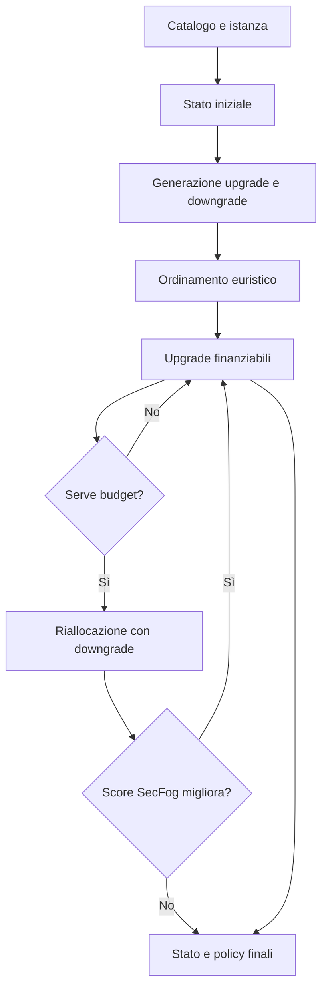

# SecFog-Greedy: Ottimizzazione dei livelli delle contromisure di sicurezza in deployment Cloud-Edge con placement fissato e budget limitato.

Il progetto implementa il **Gain-Based Greedy Reallocation (GUBR)**. L'algoritmo ordina le modulazioni delle capability mediante un'euristica locale e usa SecFog, eseguito con ProbLog, come oracolo probabilistico per valutare la sicurezza del deployment.

## Problema affrontato

Sono dati:

- un'infrastruttura Cloud-Edge;
- un'applicazione composta da più servizi e dai relativi security requirement;
- un placement iniziale, che assegna ogni servizio a un nodo;
- uno stato iniziale delle capability già attive;
- un budget non negativo.

L'obiettivo è trovare una configurazione finale con lo score si sicurezza più elevato possibile, rispettando il budget netto. Il placement e l'insieme delle capability attive restano invariati: la versione corrente applica esclusivamente azioni `MODIFY`, cioè upgrade o downgrade di livello. Non sono previste né attivazioni (`ADD`) né disattivazioni (`REMOVE`).

Il costo di una modulazione è:

$$
\Delta c = c(\ell_{new}) - c(\ell_{old}).
$$

Un upgrade consuma budget; un downgrade può liberarlo. Anche il livello `L0` è attivo e possiede un costo e una probabilità propri.

## Approcci sperimentali

| Approccio | Stato operativo iniziale | Budget operativo |
| --- | --- | --- |
| `upgrade-then-downgrade` | Placement iniziale $P_0$ | Budget fornito dall'utente |
| `downgrade-then-upgrade` | Tutte le capability attive portate a `L0` | Budget iniziale più il costo liberato rispetto a $P_0$ |

Nel primo approccio il greedy applica prima gli upgrade direttamente finanziabili e ricorre ai downgrade solo per finanziare il successivo upgrade non sostenibile. Nel secondo costruisce invece la soluzione a partire dai livelli minimi, senza disattivare capability.

Durante una run, una capability già migliorata non può essere successivamente usata come sorgente di downgrade.

## Euristica

Per una transizione tra livelli adiacenti, la qualità specifica è la riduzione della probabilità di attacco:

$$
q(a)=p_{attacco}(\ell_{old})-p_{attacco}(\ell_{new})
=e(\ell_{new})-e(\ell_{old}),
$$

dove $e(\ell)$ è l'efficacia probabilistica memorizzata nel catalogo. L'efficienza è:

$$
\eta(a)=\frac{q(a)}{\Delta c(a)}.
$$

Gli upgrade vengono ordinati per efficienza decrescente. Quando serve una riallocazione, i downgrade vengono scelti privilegiando la minore perdita di qualità per unità di budget liberata. Una riallocazione può contenere più downgrade e viene accettata soltanto se il nuovo score SecFog è strettamente maggiore di quello corrente.

## Installazione

Da eseguire nella directory principale del progetto:

```bash
python3 -m venv venv
source venv/bin/activate
python3 -m pip install --upgrade pip
python3 -m pip install -r requirements.txt
```

Per generare i grafici servono inoltre:

```bash
python3 -m pip install matplotlib numpy pandas
```


## Esecuzione

La configurazione predefinita usa `instance_n25_s5_seed42`, budget `300` e approccio `upgrade-then-downgrade`:

```bash
python3 -m src.run_fast_greedy
```

Esempi:

```bash
python3 -m src.run_fast_greedy --budget 600

python3 -m src.run_fast_greedy \
  --budget 300 \
  --approach downgrade-then-upgrade
```

È possibile sostituire i file predefiniti con `--catalog`, `--infrastructure`, `--application`, `--placement` e `--base`.

## Benchmark e grafici

```bash
# Controllo rapido
python3 -m experiments.run_fast_benchmarks --profile quick

# Matrice completa della tesi
python3 -m experiments.run_fast_benchmarks --profile thesis

# Grafici dal CSV thesis più recente
python3 -m experiments.plot_graphs
```

I benchmark salvano CSV e JSON in `results/`; i grafici vettoriali vengono scritti in `results/plots/`. Per dettagli si veda [`experiments/README.md`](experiments/README.md).

## Generazione delle istanze

Il comando seguente genera le cinque taglie sperimentali per i seed `42`, `123` e `999`:

```bash
python3 -m model.scalable_generator
```

Ogni istanza contiene `infrastructure.json`, `application.json` e `placement.json`. La generazione è deterministica rispetto al seed.


## Flusso principale



> NOTA: SecFog non decide le mosse intermedie: queste sono guidate dall'euristica. L'oracolo valuta lo stato iniziale, gli stati ottenuti dopo gruppi di upgrade diretti e le riallocazioni tentative.
